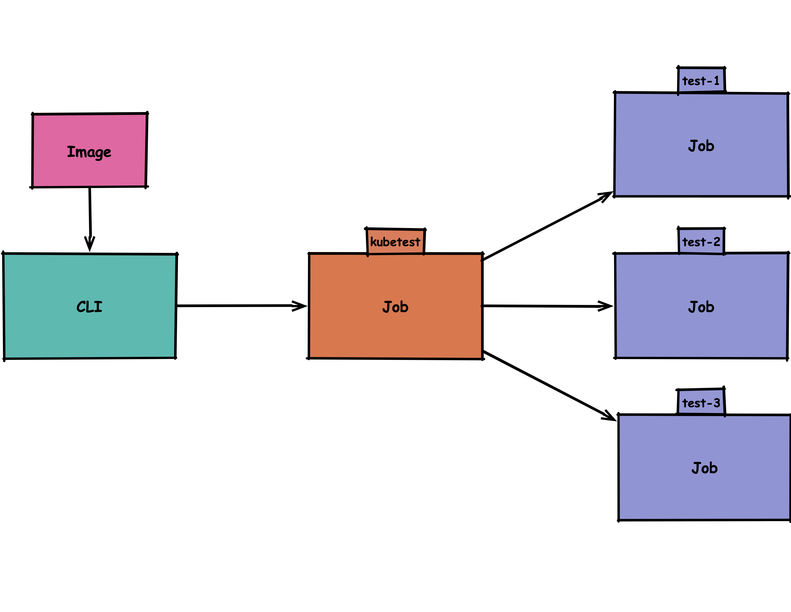

# Overview of ONIT

ONIT is a suite of command line tools and APIs to facilitate testing and debugging μONOS clusters in [Kubernetes].
At the core of ONIT is a lightweight framework for building and running integration tests on Kubernetes. On top of
the integration test framework, ONIT provides a CLI tool and API for running tests and operating on test clusters.

## KubeTest Framework

At the lowest level of ONIT is KubeTest, a lightweight command line tool and API for running parallel integration
tests on Kubernetes. The framework provides two components:
* CLI - a command line client for running tests and benchmarks in Kubernetes
* API - a test suite abstraction for grouping and parallelizing tests

The KubeTest framework is responsible for managing test jobs inside the Kubernetes cluster. Given a Docker image of
test suites, KubeTest coordinates parallel test runs across multiple namespaces - one per suite.



## ONIT Test API

While the KubeTest framework provides the test suite abstraction and coordinates running parallel tests inside a
Kubernetes cluster, it does not provide any features for operating on μONOS clusters specifically. To facilitate
μONOS integration tests, ONIT exposes additional APIs to tests for setting up, querying, and modifying μONOS clusters.

The ONIT test API supports the management of μONOS clusters at both setup and run time. Test suites can implement
setup methods to set up the μONOS cluster using the _setup API_:

```go
func (s *MySuite) SetupTestSuite() {
	setup.Database().
		SetPartitions(3).
		SetNodesPerPartition(3)
	setup.Topo().SetNodes(2)
	setup.Config().SetNodes(2)
	setup.SetupOrDie()
}
```

And test methods themselves can use the _environment API_ to query the cluster state, add devices and applications,
kill nodes, execute CLI commands, and more:

```go
func (s *MySuite) TestAddDevices(t *testing.T) {
	device1 := env.NewSimulator().
		SetName("device-1").
		AddOrDie()
	device2 := env.NewSimulator().
		SetName("device-2").
		AddOrDie()
}
```

## ONIT CLI

ONIT can also be used for manual debugging of μONOS clusters. The `onit` command line tool extends the `kubetest` CLI 
to add commands for setting up and modifying clusters, adding and removing devices, and deploying applications in
a μONOS cluster.

```bash
> onit create cluster
‣ 2019-11-15T14:42:39-08:00 onos Setup ONOS cluster
‣ 2019-11-15T14:42:39-08:00 onos Setup namespace
✓ 2019-11-15T14:42:39-08:00 onos Setup namespace
‣ 2019-11-15T14:42:39-08:00 onos Set up RBAC
✓ 2019-11-15T14:42:39-08:00 onos Set up RBAC
✓ 2019-11-15T14:42:39-08:00 onos Setup ONOS cluster
‣ 2019-11-15T14:42:39-08:00 onos Setup Atomix controller
✓ 2019-11-15T14:42:48-08:00 onos Setup Atomix controller
‣ 2019-11-15T14:42:48-08:00 onos Setup onos-cli service
‣ 2019-11-15T14:42:48-08:00 onos Setup Raft partitions
‣ 2019-11-15T14:42:48-08:00 onos Setup onos-topo
‣ 2019-11-15T14:42:48-08:00 onos Setup onos-config
✓ 2019-11-15T14:42:51-08:00 onos Setup onos-cli service
✓ 2019-11-15T14:42:58-08:00 onos Setup Raft partitions
✓ 2019-11-15T14:43:10-08:00 onos Setup onos-topo
✓ 2019-11-15T14:43:13-08:00 onos Setup onos-config
> onit add simulator -n device-1
‣ 2019-11-15T14:43:49-08:00 onos Add simulator device-1
✓ 2019-11-15T14:44:05-08:00 onos Add simulator device-1
> onit add simulator -n device-2
‣ 2019-11-15T14:44:08-08:00 onos Add simulator device-2
✓ 2019-11-15T14:44:23-08:00 onos Add simulator device-2
> onit exec -- onos topo get devices
ID         ADDRESS          VERSION   STATE
device-1   device-1:11161   1.0.0     GNMI: {Connectivity: REACHABLE, Channel: CONNECTED, Service: AVAILABLE}
device-2   device-2:11161   1.0.0     GNMI: {Connectivity: REACHABLE, Channel: CONNECTED, Service: AVAILABLE}
```

ONIT will deploy each cluster inside of its own namespace in Kubernetes, so the cluster can easily be accessed via
standard k8s tools for debugging:

```bash
> kubectl get pods -n onos
NAME                                 READY   STATUS    RESTARTS   AGE
atomix-controller-6fb99d7545-6xnrh   1/1     Running   0          3m45s
device-1                             1/1     Running   0          2m35s
device-2                             1/1     Running   0          2m16s
onos-cli-8fddbd77f-pprkl             1/1     Running   0          3m36s
onos-config-567d957775-d25p8         1/1     Running   0          3m35s
onos-topo-84dc5568f5-v8dfh           1/1     Running   0          3m36s
raft-1-0                             1/1     Running   0          3m35s
```

[Kubernetes]: https://kubernetes.io/
